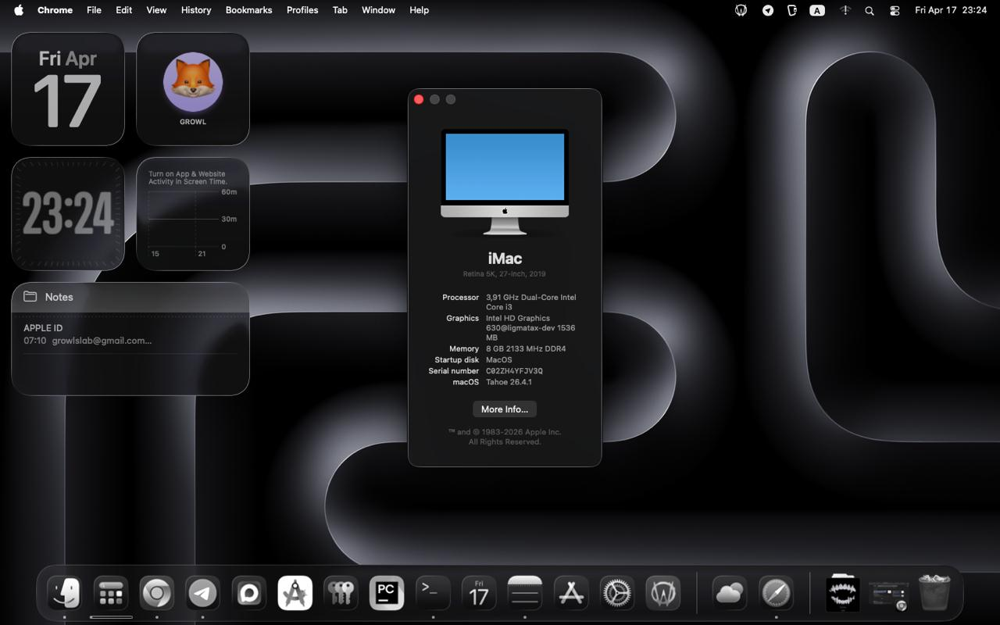

# 🍎 Hackintosh GA-H110M-S2V

OpenCore EFI for `Gigabyte GA-H110M-S2V` with `Intel Core i3-7100` and `Intel HD Graphics 630`.

## 📸 Screenshot

<small><i>MacOS Tahoe on GA-H110M-S2V</i></small>

## 🖥️ Hardware & System

| Name | Model / Version |
| --- | --- |
| Motherboard | Gigabyte GA-H110M-S2V |
| CPU | Intel Core i3-7100 |
| Graphics | Intel HD Graphics 630 |
| Audio | Realtek ALC887 |
| Ethernet | Realtek RTL8111 |
| Wi-Fi / Bluetooth | Not tested |
| Latest Tested System | macOS Tahoe 26.x |
| Other macOS Versions | Not tested |
| SMBIOS | iMac18,1 |
| Video Output Used | VGA |

## ✅ Status

| Feature | State |
| --- | :---: |
| Booting | ✅ |
| macOS Tahoe Installer / System | ✅ |
| VGA Output | ✅ |
| Intel HD 630 QE/CI | ✅ |
| Ethernet | ✅ |
| USB | ✅ |
| Apple Services | ✅ |
| Rear Analog Audio (3x AUX) | ❌ |
| Sleep | ❌ |
| Wi-Fi / Bluetooth | ❔ |
| Other macOS Versions | ❔ |

## 🔧 BIOS Settings

### `Gigabyte GA-H110M-S2V`

- `M.I.T`
  - `Advanced Frequency Settings`
    - `Advanced CPU Core Settings`
      - `Hyper-Threading Technology` = `Enabled`
      - `Intel Speed Shift Technology` = `Enabled`
- `BIOS`
  - `Fast Boot` = `Disabled`
  - `OS Type` = `Windows 8 / 10`
  - `Secure Boot` = `Disabled`
- `Peripherals`
  - `USB Configuration`
    - `XHCI Hand-Off` = `Enabled`
    - `Port 60/64 Emulation` = `Disabled`
  - `SATA And RST Configuration`
    - `SATA Mode` = `AHCI`
  - `Super IO Configuration`
    - `Serial Port` = `Disabled`
    - `Parallel Port` = `Disabled`
- `Chipset`
  - `VT-d` = `Disabled`
  - `DVMT Pre-Allocated` = `64 MB`

## 🧩 Included ACPI

- `SSDT-EC.aml`
- `SSDT-MCHC.aml`
- `SSDT-PLUG.aml`
- `SSDT-SBUS.aml`
- `SSDT-USBX.aml`

## 🔌 Included Kexts

- `Lilu.kext`
- `RealtekRTL8111.kext`
- `RestrictEvents.kext`
- `SMCProcessor.kext`
- `SMCSuperIO.kext`
- `VirtualSMC.kext`
- `WhateverGreen.kext`

## 📝 Notes

- `VGA` output is patched in `config.plist`.
- EFI uses `iMac18,1` SMBIOS.
- Tahoe support relies on a `Skip Board ID check` booter patch.
- For `iMessage`, `FaceTime`, and other Apple services, generate your own SMBIOS values before daily use.

## Known Issues

- Built-in rear analog audio jacks are not working.
- Sleep is not working correctly.

## Credits

Inspired by and based on research from these repositories:

- [DMNerd/Hackintosh-H110M](https://github.com/DMNerd/Hackintosh-H110M)
- [Jakmaster199/OpenCore-H110-7thGen](https://github.com/Jakmaster199/OpenCore-H110-7thGen)
- [jukfiuune/Hackintosh_i3-7100_B250_HD630_OC_EFI](https://github.com/jukfiuune/Hackintosh_i3-7100_B250_HD630_OC_EFI)
